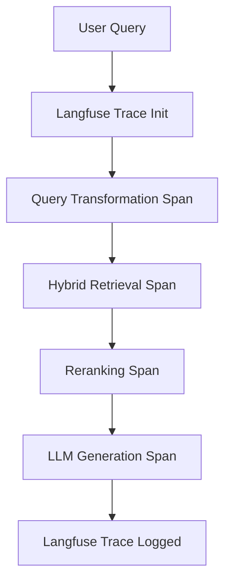

# ScholarRAG: Challenges, Solutions & Observability Guide

This document summarizes the core technical hurdles, errors, and design decisions encountered during the development of the ScholarRAG pipeline, along with how they were resolved. It also includes details on how **Observability & Monitoring (via Langfuse)** is applied to maintain a production-grade LLM system.

---

## 1. Key Challenges & Technical Errors

### Challenge 1: LLM Quota Overruns (Gemini Developer APIs)
*   **The Problem**: The initial pipeline relied on Gemini Developer API Keys. Due to standard daily rate limits and quota caps, requests frequently failed with `429: Quota exceeded` or stopped rendering.
*   **The Resolution**: 
    *   First, we implemented a fallback path using an **OpenAI-compatible AWS Bedrock proxy** endpoint (`openai.gpt-oss-120b`).
    *   Second, we integrated **enterprise-grade Vertex AI** authentication (`google-genai` SDK) utilizing a dedicated service account JSON file (`service.json`). This bypasses standard developer tier limitations and leverages production cloud quotas.

### Challenge 2: AWS Bedrock Account-Wide Use-Case Validation & Throughput Constraints
*   **The Problem**: When testing direct Bedrock API calls via `boto3` for models like `amazon.nova-2-lite-v1:0` or Anthropic Claude, the Bedrock service threw two distinct runtime validation errors:
    1. `ResourceNotFoundException: Model use case details have not been submitted for this account.`
    2. `ValidationException: Invocation of model ID with on-demand throughput isn’t supported.`
*   **The Resolution**: We built fallback logic inside `pipeline.py` to check configurations and route requests to the OpenAI-compatible mantle endpoint. When those keys expired, we deactivated direct Bedrock configurations in `config.py` to route all queries cleanly to **Vertex AI**.

### Challenge 3: Streaming JSON Formatting & JSONDecodeErrors in RAG
*   **The Problem**: RAG pipelines require structured citation responses (holding both the final answer text and the citation sources). When streaming tokens incrementally using Server-Sent Events (SSE), parsing the JSON stream is highly error-prone because intermediate JSON frames are not syntactically complete. This resulted in `JSONDecodeErrors` on the client.
*   **The Resolution**: 
    *   We migrated from raw token SSE streaming to **synchronous backend routing**. The client sends a request to `/chat`, which processes the entire request in the background and returns a single structured response with the answer, references, and citation indexes clearly defined.
    *   To keep the UI clean, we added `react-markdown` on the frontend. The markdown processor parses rich text formatting, lists, code blocks, and replaces inline citation tags (like `[1]`, `[2]`) with interactive, clickable citation badge links that scroll directly to the document source snippet.

### Challenge 4: Credential Secrets Leakage in Git Pushes
*   **The Problem**: During pushing code to GitHub, the unified credentials key file `service.json` was staged and committed, triggering GitHub's automated push protection rules (`GH013: Push cannot contain secrets`).
*   **The Resolution**: We performed a soft reset on the git commit, removed the credential files from the cache index using `git rm --cached`, added strict credential file patterns to `.gitignore`, and successfully pushed a clean version of the code.

---

## 2. Query Transformation (Rewriting + Expansion)

### The Challenge: Conversational Queries & Keyword Discrepancies
Standard keyword matches perform poorly when users input conversational questions (e.g., *"Wait, can you tell me what the main point of section 2 was?"*). Furthermore, research papers use technical terminology, whereas users might search using common terms.

### The Solution:
We implemented a **Query Transformation layer** using Gemini 2.5 Flash:
1.  **Query Rewriting**: Rephrases conversational inputs to isolate the core scientific questions, removing conversational filler.
2.  **Query Expansion**: Generates technical synonyms and domain-specific academic terminology related to the topic.
*Example: "how do transformers self attention work" -> "transformer architecture self-attention mechanism scaled dot-product multi-head attention neural network"*

This optimized query is passed to the Hybrid Vector + BM25 search database, significantly improving chunk relevance.

---

## 3. Observability & Monitoring with Langfuse

In production AI systems, LLM calls are non-deterministic black boxes. Monitoring latency, cost, prompt versions, and user queries is crucial. We integrated **Langfuse** into the backend to provide trace coverage across the entire RAG pipeline.

### Key Use-Cases for Observability

#### 1. Pinpointing Retrieval Failures vs. LLM Failures
*   **Scenario**: A user reports that the assistant gave an incorrect or blank response.
*   **With Observability**: You open the Langfuse dashboard, inspect the trace for that query, and look at the `Hybrid-Retrieval` span. 
    *   If the retrieval span shows 0 documents found, the issue lies in the chunking, embedding, or database filter parameters.
    *   If the retrieval span retrieved correct documents, but the LLM output was poor, you can debug the system prompt or temperature settings.

#### 2. Prompt Management & Version Control
*   **Scenario**: You want to update the system prompt template (e.g., modifying how strict references are enforced) without redeploying backend code.
*   **With Observability**: Langfuse provides a central Prompt Registry. The backend dynamically fetches the active version of the prompt using the `PromptManager`. Traces log which prompt version was used for each query, making it easy to run A/B testing on prompt performance.

#### 3. Token Tracking & Cost Optimization
*   **Scenario**: The cloud bill for Vertex AI or Bedrock usage spikes.
*   **With Observability**: Langfuse automatically tracks input/output token counts for each model generation call. You can run analytics to see which queries consumed the most tokens and identify if system prompts are too long or if users are sending excessively large documents.

#### 4. Trace Generation Span Debugging
*   **Scenario**: High latency is impacting user experience.
*   **With Observability**: The dashboard shows a waterfall timeline of execution steps. You can see how many milliseconds were spent on database retrieval, local cross-encoder reranking, and generation. This helps you decide if you need to optimize the local reranker models or upgrade database hardware.
